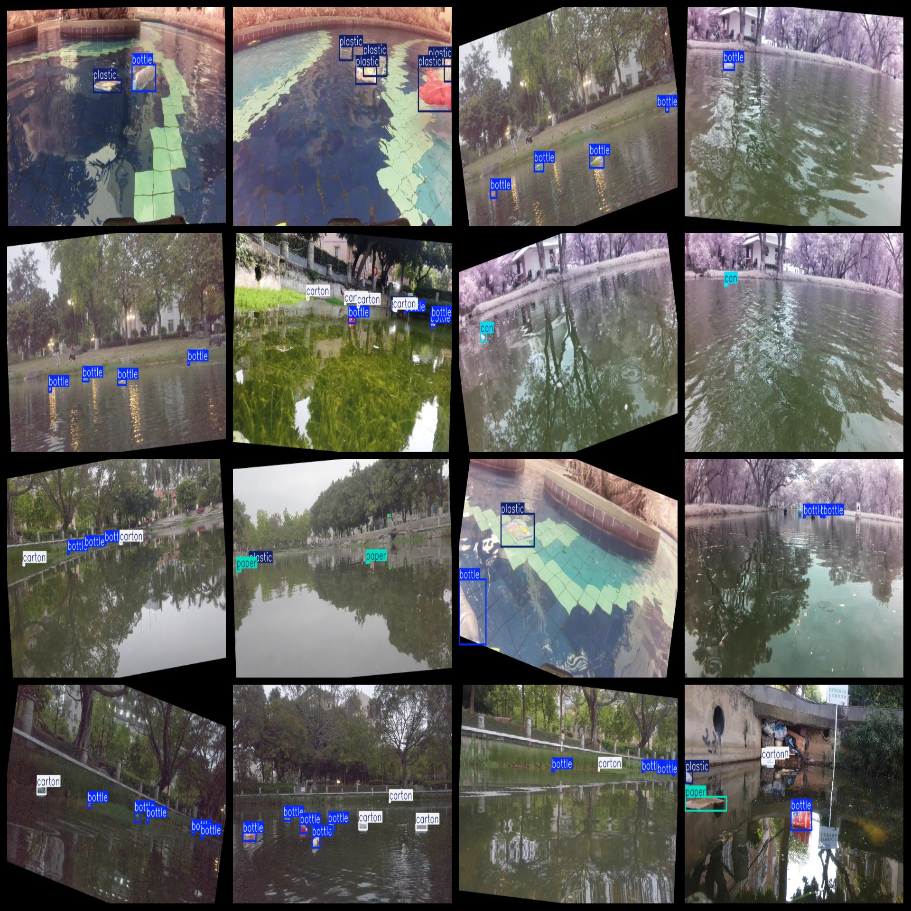
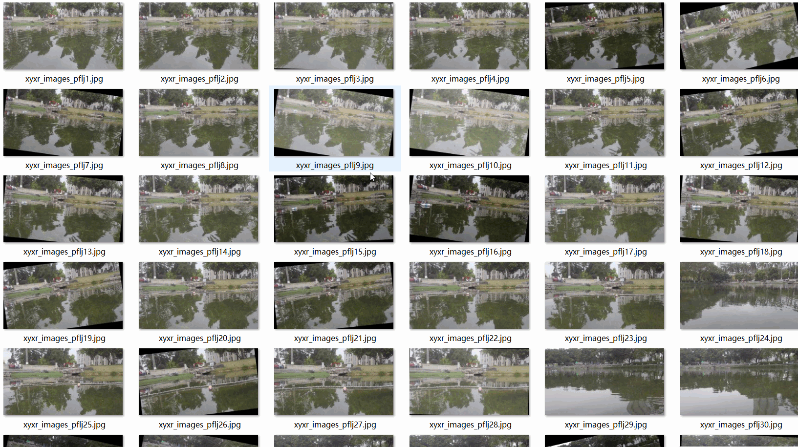

# Water Surface Floating Garbage Classification Detection Dataset 5-class7265 imagesVOC+YOLO format

The dataset consists of 7265 images in VOC+YOLO format, divided into three folders for storing images, xml files, and txt files. The JPEGImages folder contains a total of 7265 jpg images, the Annotations folder contains a total of 7265 xml files, and the labels folder contains a total of 7265 txt files. There are 5 categories of labels: "bottle", "can", "carton", "paper", and "plastic".

Each category has a set of boxes (yolo format) as follows:
- bottle boxes = 11030
- can boxes = 1854
- carton boxes = 2512
- paper boxes = 1107
- plastic boxes = 4608

The total number of boxes is 21111.

The image resolution is clear.

The images have been enhanced to some extent (approximately 3000 images with minor enhancements have been selected and are stored separately).

The shape of the labels is rectangular boxes, which are used for target detection recognition.

Important note: No guarantees are made regarding the accuracy or reliability of the models trained on this dataset or any weight files. The dataset provides accurate and reasonable annotations only.

Annotation and image details are as follows:

## Images

---

Here is a pay link on Stripe (https://buy.stripe.com/3cs8yP7sY87d0vu9AB). Please contact me lonlonago@foxmail.com after funding $89, and I will send you a complete data files, thank you!

